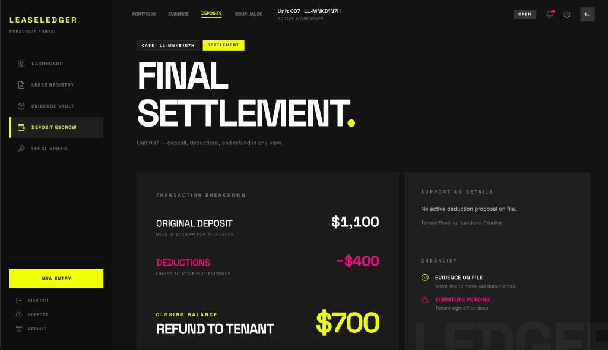
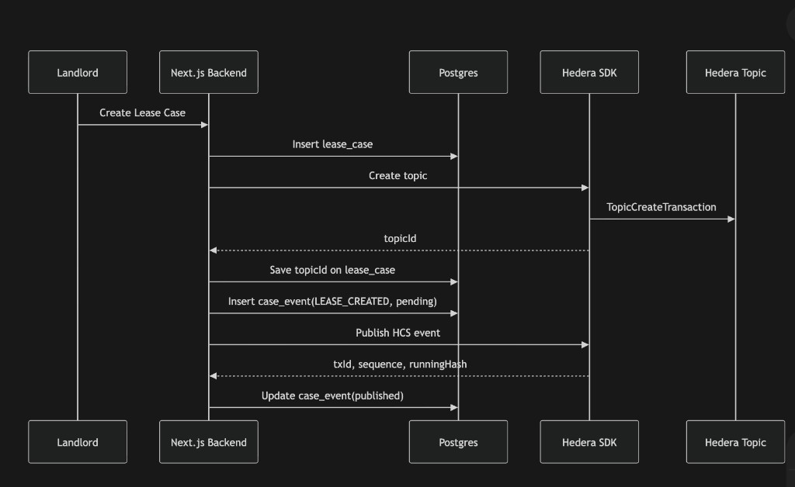
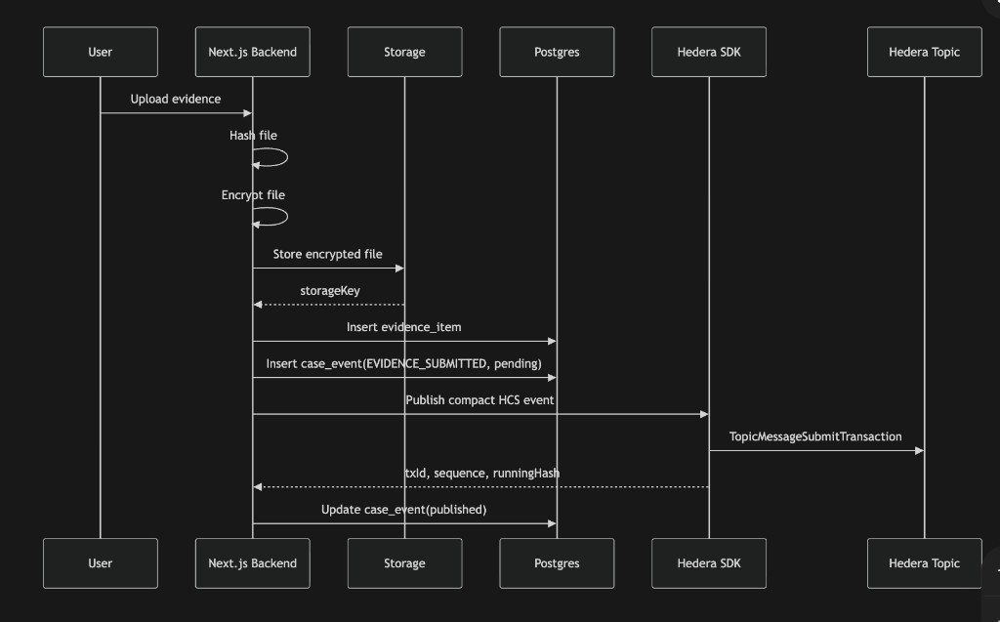
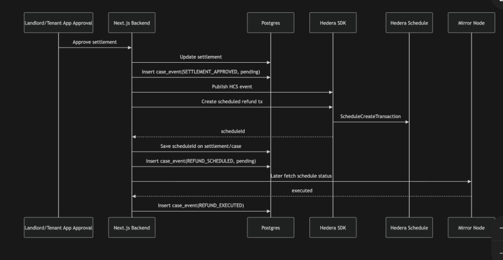

# LeaseLedger

**LeaseLedger** is a web app for **security deposit workflows**: landlords and tenants share **one workspace** per lease to upload **evidence**, propose **deductions**, and move toward **settlement** and **refund**—with optional **Hedera Consensus Service (HCS)** anchoring for an immutable audit trail.

---

## What you can do in the app

| Role | Typical actions |
|------|-----------------|
| **Landlord** | Create cases, adjust deposit / deduction proposal (before settlement locks), invite tenant by email, upload evidence, review the other party’s evidence, publish settlement proposal, schedule and confirm refund (when enabled). |
| **Tenant** (invited) | Sign in via **magic link** to the invited email, view the case, upload evidence, acknowledge or **dispute** the other party’s evidence, **approve or reject** a proposed settlement. |

**Evidence** files are **hashed**, **encrypted** server-side, and stored (**Supabase Storage** or local `data/encrypted-evidence/`). The UI can show decrypted previews for image-type evidence when you are signed in and have case access.

---

## Product UI (settlement example)

The **Executive Portal** centers on clear money lines: original deposit, deductions, and refund to tenant, plus status and checklist-style cues.



---

## Technical stack

| Layer | Choice |
|--------|--------|
| Framework | **Next.js 15** (App Router), **React 19** |
| Database | **PostgreSQL** via `postgres` (JS driver), SQL migrations under `supabase/migrations/` |
| Auth | **Supabase Auth** (landlord password; tenant OTP / invite flows) |
| File storage | **Supabase Storage** (`evidence` bucket) or **local** encrypted files |
| Crypto | **AES-256-GCM** envelope encryption (`EVIDENCE_ENCRYPTION_KEY`) |
| Ledger (optional) | **Hedera** — HCS topic messages, schedule/refund hooks when configured |
| Tests | **Vitest** (`npm test`) |

---

## Architecture idea: app database + optional Hedera

1. **Postgres** holds the live product state: leases, memberships, evidence metadata, settlements, `case_events`, invite tokens, Hedera sync/outbox fields.
2. **Hedera** (when operational) records **compact** event payloads on an HCS **topic** per lease so third parties can verify what was asserted on-chain.
3. Failed or deferred Hedera publishes can be retried via an **outbox** pattern (`hedera_outbox` + cron route).

---

## Backend flows (sequence diagrams)

### 1. Create lease case

Landlord creates a case → row in Postgres → (optional) **create HCS topic** → save `topicId` on the lease → insert `LEASE_CREATED` event → publish to Hedera → mark event **published** with tx metadata.



### 2. Evidence upload & notarization

User uploads → backend **hashes** plaintext, **encrypts** blob → **store** ciphertext → **insert** `evidence_items` + `case_events` (`EVIDENCE_SUBMITTED`, pending) → **submit** compact message to HCS → **update** event with `published` + sequence / running hash / tx id when available.



### 3. Approve settlement & schedule refund

User approves settlement → **update** settlement + insert `SETTLEMENT_APPROVED` → publish HCS event → (when configured) **create scheduled refund** on Hedera → persist **schedule id** → log `REFUND_SCHEDULED` → later, **mirror** verification → `REFUND_EXECUTED`.



---

## Repository layout (high level)

```
src/app/           # App Router pages + API routes (/api/lease-cases/…)
src/components/    # UI (case, evidence, settlement, shell)
src/server/        # Repos, auth session, Hedera helpers, crypto
src/lib/           # Pure helpers (money, settlement workflow, etc.)
supabase/migrations/   # Postgres schema + seed-friendly SQL
```

Important API surface (all under `/api/lease-cases/[leaseId]/…` where relevant):

- **POST** create case, **GET** list cases for the signed-in user  
- **Invites** — landlord-only; magic link attaches tenant to case  
- **Evidence** — multipart upload; **GET** `…/evidence/[id]/file` serves decrypted bytes for authorized users  
- **Deduction proposal** — landlord-only while editable  
- **Settlement** — propose (landlord), respond approve/reject (both), schedule/complete refund (landlord)

---

## Local setup

1. **Node** — use a current LTS; install deps: `npm install`.

2. **Environment** — copy `.env.example` → `.env.local` and fill:
   - `DATABASE_URL` — Postgres (Supabase pooler URI is fine).
   - `NEXT_PUBLIC_SUPABASE_URL`, anon/publishable key, `SUPABASE_SERVICE_ROLE_KEY` (Storage + admin invite).
   - `NEXT_PUBLIC_SITE_URL` — public origin (e.g. `http://localhost:3000` or your Vercel URL); used for redirects and invite links.
   - `EVIDENCE_ENCRYPTION_KEY` — base64 **32-byte** key; **do not rotate** lightly or old blobs won’t decrypt.
   - Hedera vars — see `.env.example` if you want HCS/scheduling live.

3. **Database** — run migrations against your Postgres (e.g. Supabase SQL editor or `supabase db push`).

4. **Supabase Auth** — add redirect URLs such as  
   `https://<your-host>/auth/callback`  
   (wildcard `https://*.vercel.app/auth/callback` helps previews).

5. **Run** — `npm run dev` → [http://localhost:3000](http://localhost:3000)

6. **Quality** — `npm run lint`, `npm test`, `npm run build`

---

## Demo data

Migrations can seed a sample lease (`lease-001`, etc.); a later migration may rewrite copy and amounts for a **realistic walkthrough**. With **`DATABASE_URL` unset**, the app falls back to **in-memory mocks** (no real uploads or Hedera).

---

## License / status

Private project (`"private": true` in `package.json`). Adjust as needed for your distribution.
